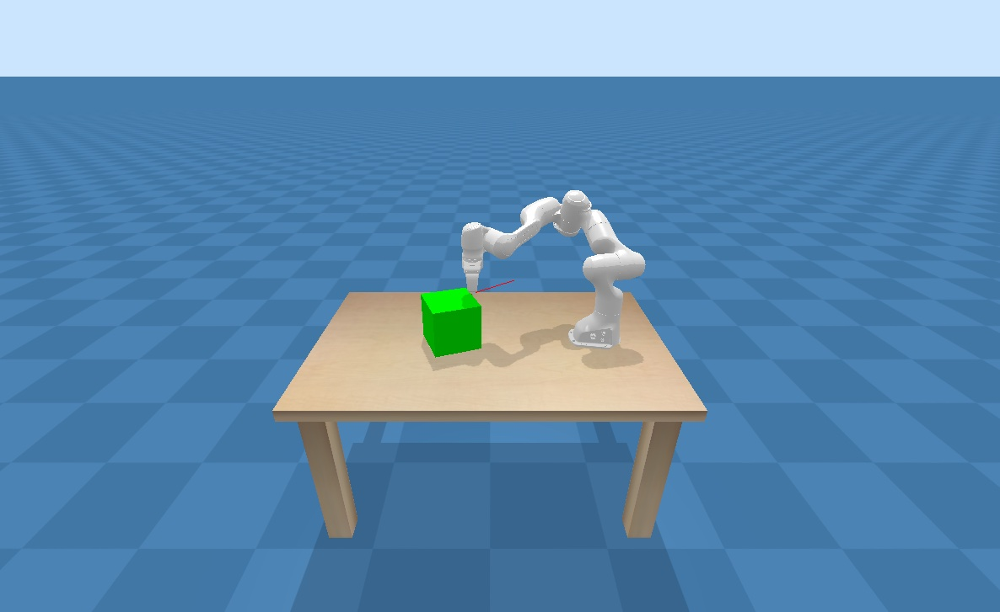

# Manipulation Engine

## Install with a virtualenv
```bash
python3 -m pip install --user virtualenv
python3 -m venv env
source env/bin/activate
pip3 install --upgrade pip
git clone https://github.com/Zackory/mengine.git
cd mengine
pip3 install -e .
```

## Quick Install
```bash
python3 -m pip install mengine@git+https://github.com/Zackory/mengine.git
```

## Example
```bash
cd examples
python3 lecture01_pushing.py
```



